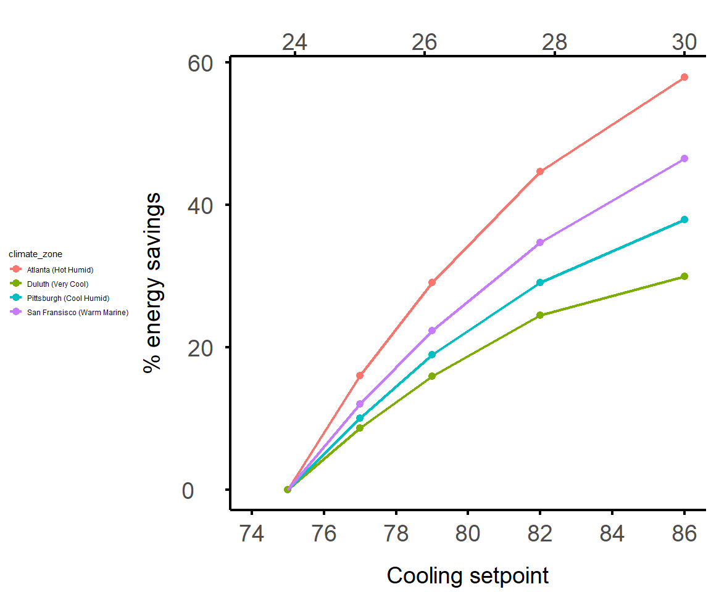

2019\_09\_13\_increased\_setpoints\_savings\_plots
================

``` r
library(tidyverse)
library(skimr)
```

## Load data

``` r
# Data from http://comfort.cbe.berkeley.edu/energycalc/
# Making cooling-only version of what Ed and Hui call the 'cup diagram'
# Draft poster (with older version of plot) here: https://berkeley.app.box.com/folder/86777141745

t1 <- tibble(
  cooling_setpoint_f = c( 75, 77, 79, 82, 86),
  climate_zone = "San Fransisco (Warm Marine)", 
  savings = c(0, 12, 22.3, 34.7, 46.5)
)

t2 <- tibble(
  cooling_setpoint_f = c( 75, 77, 79, 82, 86),
  climate_zone = "Atlanta (Hot Humid)", 
  savings = c(0, 16, 29.1, 44.6, 57.9)
)


t3 <- tibble(
  cooling_setpoint_f = c( 75, 77, 79, 82, 86),
  climate_zone = "Miami (Very Hot Humid)", 
  savings = c(0, 12.2, 23.3, 38.6, 55.5)
)


t4 <- tibble(
  cooling_setpoint_f = c( 75, 77, 79, 82, 86),
  climate_zone = "Pittsburgh (Cool Humid)", 
  savings = c(0, 10, 18.9, 29.1, 37.9)
)

t5 <- tibble(
  cooling_setpoint_f = c( 75, 77, 79, 82, 86),
  climate_zone = "Duluth (Very Cool)", 
  savings = c(0, 8.6, 15.9, 24.5, 29.9)
)

energy_savings <- bind_rows(t1, t2, t3, t4, t5)

skim(energy_savings)
```

    ## Skim summary statistics
    ##  n obs: 25 
    ##  n variables: 3 
    ## 
    ## -- Variable type:character ------------------------------------------------------------------------------------------------------
    ##      variable missing complete  n min max empty n_unique
    ##  climate_zone       0       25 25  18  27     0        5
    ## 
    ## -- Variable type:numeric --------------------------------------------------------------------------------------------------------
    ##            variable missing complete  n mean    sd p0 p25  p50  p75 p100
    ##  cooling_setpoint_f       0       25 25 79.8  3.95 75  77 79   82   86  
    ##             savings       0       25 25 22.7 17.55  0  10 22.3 34.7 57.9
    ##      hist
    ##  <U+2587><U+2587><U+2587><U+2581><U+2581><U+2587><U+2581><U+2587>
    ##  <U+2587><U+2586><U+2585><U+2585><U+2586><U+2583><U+2583><U+2583>

## Make plot

``` r
# Filter out Miami

energy_savings <- energy_savings %>%
  filter(climate_zone != "Miami (Very Hot Humid)")
```

``` r
cooling_plot <- ggplot(energy_savings, aes(x = cooling_setpoint_f, y = savings)) + 
  geom_point((aes(col = `climate_zone`)), size = 4, show.legend = T) + 
  geom_line((aes(col = `climate_zone`)), size =1.5, show.legend = T) + 
  theme_classic() +
  ylab("% energy savings\n") + 
  xlab("\nCooling setpoint") + 
  theme(
        axis.text.x = element_text(size = 28, vjust=-0.5),
        axis.text.y = element_text(size = 28, hjust = -0.5),  
        axis.title.x = element_text(size = 28),
        axis.title.y = element_text(size = 28),
        legend.position="left",
        axis.line = element_line(colour = 'black', size = 1.5),
        axis.ticks = element_line(colour = 'black', size = 1.5),
        axis.ticks.length = unit(6, "pt")
        
      ) +
  scale_x_continuous( limits = c(74, 86),  breaks = c(74, 76, 78, 80, 82, 84, 86),  sec.axis = sec_axis(~(.-32)*(5/9), name = ""))
  

cooling_plot
```

<!-- -->
